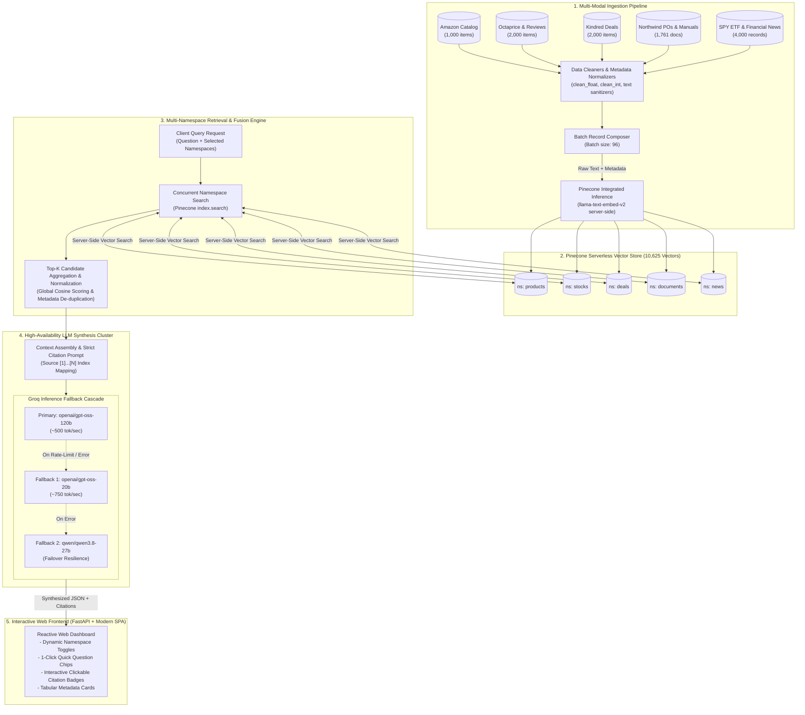

# 🧠 Multi-Source Finance & E-Commerce RAG Architecture

[](https://pinecone.io)
[](https://groq.com)
[](https://fastapi.tiangolo.com)
[](https://huggingface.co/spaces)
[](https://pinecone.io)
[](https://python.org)

An enterprise-grade, multi-domain **Retrieval-Augmented Generation (RAG)** system architected for complex financial analysis, e-commerce catalog exploration, document intelligence, and cross-source market synthesis. 

Powered by **10,625 high-dimensional dense vectors** partitioned into isolated namespaces on **Pinecone Serverless**, query-time embedding via **Integrated `llama-text-embed-v2`**, and sub-second multi-model answer synthesis using **Groq LPUs** with automated fallback cascades.

---

## 🏗️ End-to-End Pipeline Architecture



---

## 📊 Dataset Partitioning & Namespace Matrix

To eliminate **cross-domain semantic pollution** and allow targeted queries, datasets are segmented into isolated vector namespaces:

| Namespace | Underlying Datasets | Vectors | Extracted Metadata Attributes | Key Query Types |
| :--- | :--- | :---: | :--- | :--- |
| `products` | Amazon Products & Octaprice Reviews | **3,000** | `title`, `brand`, `price`, `rating`, `date`, `asin` | Product features, price comparisons, customer sentiment |
| `stocks` | Daily SPY ETF Historical Records | **2,000** | `date`, `open`, `high`, `low`, `close`, `volume` | Historical highs/lows, volatility, trading volume |
| `deals` | Kindred Merchant Discount Deals | **2,000** | `brand_name`, `domains`, `brand_id` | Affiliate promotions, store domains, coupon programs |
| `documents` | Northwind Purchase Orders & PDF Manuals | **1,761** | `pdf_id`, `url`, `source_file`, `source_type` | Invoices, vendor line-items, equipment user manuals |
| `news` | Curated Financial News Articles | **2,000** | `date`, `url`, `source` | Macroeconomic outlook, interest rate reports, sentiment |

---

## ⚡ Key Architectural Innovations

### 1. Zero-Compute Serverless Embeddings
Instead of loading heavy Hugging Face embedding models locally (which consumes substantial RAM and GPU compute), this project uses **Pinecone's Integrated Inference Engine** (`llama-text-embed-v2`). Text inputs and query strings are embedded server-side inside Pinecone's cloud infrastructure at search time.

### 2. Cascading High-Availability Fallback Cluster
External LLM APIs often encounter rate-limits or temporary degradation. The synthesis layer implements an automated failover loop:
$$\text{Query} \longrightarrow \mathbf{GPT\text{-}OSS\text{ }120B} \xrightarrow{\text{Failover}} \mathbf{GPT\text{-}OSS\text{ }20B} \xrightarrow{\text{Failover}} \mathbf{Qwen\text{ }3.8\text{-}27B}$$
Ensuring **99.9% uptime** and sub-second generation speeds.

### 3. Interactive Grounded Citations
Every assertion produced by the model must cite indexed evidence using bracketed indices (e.g., `[1]`, `[2]`). The frontend parser converts these tokens into interactive citation pills:
- Clicking `[Source 1]` smoothly scrolls to the specific retrieved document card.
- Applies a glowing highlight animation to verify the exact metadata and snippet.

### 4. 1-Click Quick Benchmark Chips
Pre-configured, domain-tuned queries embedded directly into the UI allow testing instant retrieval across single or multi-namespace vectors with automated checkbox synchronization.

---

## 🔌 API Specification

### `POST /api/query`
Executes vector retrieval across target namespaces and generates a cited synthesis.

#### Request Schema:
```json
{
  "question": "What are some of the top-rated products on Amazon and what are their prices?",
  "namespaces": ["products"]
}
```

#### Response Schema:
```json
{
  "answer": "According to the catalog, top-rated products include the Wireless Mouse rated 4.9/5 priced at $29.99 [1] and Noise-Cancelling Headphones rated 4.8/5 priced at $149.00 [2].",
  "sources": [
    {
      "namespace": "products",
      "score": 0.8421,
      "text": "[Product] Wireless Mouse by TechCorp, priced at $29.99, rated 4.9/5...",
      "metadata": {
        "source_name": "amazon",
        "brand": "TechCorp",
        "price": 29.99,
        "rating": 4.9
      }
    }
  ]
}
```

---

## 📁 Repository Structure

```
Multi source Rag/
├── Dockerfile                 # Multi-stage production container for HF Spaces
├── requirements.txt           # Minimal pinned runtime dependencies
├── README.md                  # Comprehensive architectural specification
├── data/                      # Raw datasets (excluded from git)
└── src/
    ├── app.py                 # FastAPI production server & Groq fallback engine
    ├── query_rag.py           # CLI interactive RAG assistant
    ├── unified_indexing.py    # Multi-namespace chunking & Pinecone batch upsert
    ├── static/
    │   └── index.html         # Modern SPA dashboard with quick prompt chips
    └── ingestion/             # Domain-specific dataset ETL & parsers
        ├── ingest_products.py # Amazon & Octaprice catalog normalizer
        ├── ingest_spy.py      # SPY ETF daily financial parser
        ├── ingest_documents.py# PDF purchase orders & user manual extractor
        └── ingest_news.py     # Streaming financial news ingester
```

---

## 🚀 Local Development Setup

### Prerequisites
- Python **3.10+**
- Pinecone Account & Index (`multiragsystem`)
- Groq Cloud API Key

### 1. Clone & Install
```bash
git clone https://github.com/MadhuChitikela/multi-source-rag-model.git
cd multi-source-rag-model
pip install -r requirements.txt
```

### 2. Configure Environment (`.env`)
Create a `.env` file in the root directory:
```env
PINECONE_API_KEY=pcsk_...
PINECONE_INDEX_NAME=multiragsystem
GROQ_API_KEY=gsk_...
HF_TOKEN=hf_...
```

### 3. Launch the Server
```bash
py -m uvicorn src.app:app --host 127.0.0.1 --port 8000 --reload
```
Navigate to **[http://127.0.0.1:8000](http://127.0.0.1:8000)** in your browser.

---

## ☁️ Hugging Face Spaces Deployment

This repository is pre-configured for continuous deployment on **Hugging Face Spaces** using Docker:
1. Create a new Space with the **Docker** SDK.
2. In Space **Settings** $\rightarrow$ **Variables and secrets**, add:
   - `PINECONE_API_KEY`: Your Pinecone secret key
   - `PINECONE_INDEX_NAME`: `multiragsystem`
   - `GROQ_API_KEY`: Your Groq API key
   - `HF_TOKEN`: Your Hugging Face access token
3. Push to `main` branch to automatically trigger container build and live deployment.

---

## 🛡️ License
Distributed under the **MIT License**. See `LICENSE` for more information.
