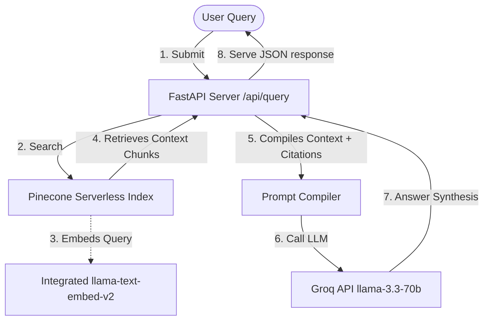

# 🧠 Multi-Source Finance & E-Commerce RAG System

[](https://pinecone.io)
[](https://groq.com)
[](https://fastapi.tiangolo.com)
[](https://huggingface.co/spaces)

A production-grade Retrieval-Augmented Generation (RAG) assistant designed for financial analysis and e-commerce inquiry. The system chunks and indexes data across **five distinct domains** (totaling **10,625 vectors**) into a unified Pinecone serverless index, serving the data via a FastAPI web API and an interactive, lightweight light-mode frontend single-page application (SPA).

---

## 🛠️ Architecture Workflow



---

## 📊 Dataset Distribution & Namespaces

The system segments different datasets into separate namespaces to prevent content pollution and allow users to target specific knowledge domains:

| Dataset | Pinecone Namespace | Records Indexed | Key Attributes Extracted |
| :--- | :--- | :--- | :--- |
| **Amazon Products** | `products` | 1,000 | Title, brand, price, rating, description |
| **Octaprice Products & Reviews** | `products` | 2,000 | Name, brand, price, review content, rating, date |
| **Kindred Merchant Deals** | `deals` | 2,000 | Brand name, discount domains, brand ID |
| **Northwind Purchase Orders** | `documents` | 1,000 | Purchase order text, companies, dates |
| **User Manuals** | `documents` | 761 | Reference URLs, source files |
| **Daily SPY ETF Market Data** | `stocks` | 2,000 | Date, open, close, high, low, volume |
| **Financial News** | `news` | 2,000 | News text, publish date, source name, URLs |

---

## ✨ Advanced Features

* **Pinecone Integrated Inference**: Eliminates local vector generation by letting Pinecone's serverless engine embed queries and texts directly using the `llama-text-embed-v2` model.
* **Interactive Citations**: The frontend automatically parses LLM bracketed citations (e.g. `[Source 1]`) and turns them into clickable badges. Clicking a citation badge smoothly scrolls to and highlights the corresponding document card in the source list.
* **Tabular Property Grids**: Displays structured metadata (dates, scores, URLs, stock volume, prices) in neat tables within the source cards.
* **Robust Model Fallbacks**: Automatically falls back between `llama-3.3-70b-versatile`, `llama-3.3-70b-specdec`, and `llama3-70b-8192` to guarantee high availability on the Groq API.

---

## 📁 File Structure

```
Multi source Rag/
├── Dockerfile                 # Hugging Face deployment container layout
├── requirements.txt           # Python backend dependencies
├── README.md                  # Project documentation (HF frontmatter)
├── data/                      # Raw dataset directory (Git-ignored)
└── src/
    ├── app.py                 # FastAPI backend server
    ├── query_rag.py           # CLI interactive RAG assistant
    ├── unified_indexing.py    # Pipeline to chunk and index samples
    ├── static/
    │   └── index.html         # Lightweight light-mode SPA frontend
    └── ingestion/             # Cleaning and parsing scripts for raw data
        ├── ingest_products.py
        ├── ingest_spy.py
        ├── ingest_documents.py
        └── ingest_news.py
```

---

## 🔧 Installation & Local Setup

> [!NOTE]
> Make sure python 3.10+ is installed on your local machine.

1. **Clone the repository**:
   ```bash
   git clone https://github.com/MadhuChitikela/multi-source-rag-model.git
   cd multi-source-rag-model
   ```

2. **Install requirements**:
   ```bash
   pip install -r requirements.txt
   ```

3. **Configure your secrets**:
   Create a `.env` file in the project root:
   ```env
   PINECONE_API_KEY=your_pinecone_api_key
   PINECONE_INDEX_NAME=multiragsystem
   GROQ_API_KEY=your_groq_api_key
   HF_TOKEN=your_huggingface_access_token
   ```

4. **Run FastAPI locally**:
   ```bash
   py -m uvicorn src.app:app --host 127.0.0.1 --port 8000 --reload
   ```
   Open **[http://127.0.0.1:8000](http://127.0.0.1:8000)** in your browser.

---

## 🌐 Deployment to Hugging Face Spaces

This application is built with a `Dockerfile` for seamless deployment as a Docker Space on Hugging Face.

> [!IMPORTANT]
> Since the `.env` file is excluded from Git to prevent secret exposure, you must configure the following variables in the **Settings** tab under **Variables and secrets** on Hugging Face:
> * `PINECONE_API_KEY`
> * `PINECONE_INDEX_NAME` (Value: `multiragsystem`)
> * `GROQ_API_KEY`
> * `HF_TOKEN`
